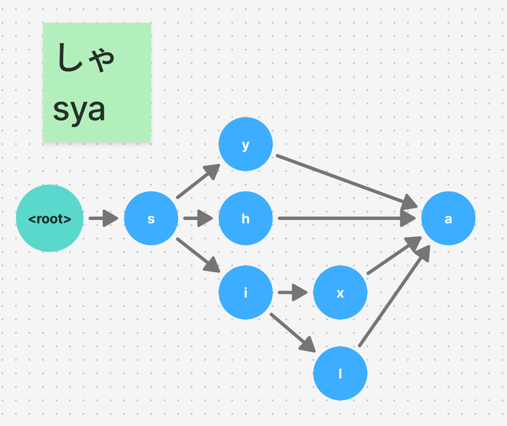

# RomajiHelper

Japanese Romanization parser for typing games in .NET / Unity

## 概要

RomajiHelperは.NET / Unity向けのローマ字解析ライブラリです。ひらがな/カタカナの入力から有向非巡回グラフ(DAG)を作成し、ローマ字の入力として有効なパターンを取得できます。

各ノードがアルファベットに対応するため、ノードを辿ることで入力先の候補を容易にチェックできます。これを用いることで、タイピングゲームの入力判定などを容易に実装することが可能になります。

## インストール

### .NET CLI

```bash
$ dotnet add RonajiHelper
```

### Unity

[NuGetForUnity](https://github.com/GlitchEnzo/NuGetForUnity)を利用してNuGetからRonajiHelperをインストールします。

## コンセプト

ローマ字入力を扱うには、「し」に対する`si`、`shi`や「きゃ」に対する`kya`、`kixya`, `kilya`など、同一の仮名に対して複数のパターンを考慮する必要があります。これは各アルファベットをノードとして、以下のような有向非巡回グラフ(DAG)で表現することが可能です。



RonajiHelperはひらがな/カタカナの文字列を入力として上のようなグラフを構築する機能を提供します。

## 使い方

```cs
using RomajiHelper;

var node = RomajiNode.Parse("きょうはいいてんきですね");

// 現在のnodeから全ての有効なローマ字のパターンを列挙する
foreach (var pattern in node.Patterns())
{
    Console.WriteLine(pattern);
}

// 単一のパターンのみを取得する
var first = node.FirstPattern();

// nodeを順にたどって解析する
// Rootのノードは対応する文字を持たないことに注意
var currentNode = node;
foreach (currentNode.IsTerminal) // ノードの終了判定
{
    var key = Console.ReadKey().KeyChar;
    foreach (var nextNode in node.Nodes)
    {
        if (nextNode.Character == key) // ノードのアルファベットと比較
        {
            node = nextNode;
            break;
        }
    }
}
```

## ライセンス

このライブラリは[MITライセンス](LICENSE)の下で公開されています。